# 🎨 DESSIN SIMPLE - 58 Containers + Route

## 🎯 RÉSUMÉ EN 3 POINTS

1. **48 containers au sol** (comme avant)
2. **+ 10 containers empilés** au-dessus (comme un 2ème étage)
3. **+ 1 route** en dessous de tout

**= 58 containers au total + 1 route**

---

## 📐 VUE DE DESSUS (vu du ciel)

## 📐 VUE DE DESSUS (vu du ciel)

```
                    ┌─────────────────────────────────────────────┐
                    │         SUBSTATION 200 MW                   │
                    │         (en haut, Y = 15m)                  │
                    └─────────────────────────────────────────────┘
                                        
    ┌─────────────────────────────────────────────────────────────┐
    │                                                               │
    │  PB1 (-75m)    PB2 (-25m)    PB3 (+25m)    PB4 (+75m)       │
    │                                                               │
    │   ┌─┐ ┌─┐      ┌─┐ ┌─┐      ┌─┐ ┌─┐      ┌─┐ ┌─┐          │
    │   │C│ │C│      │C│ │C│      │C│ │C│      │C│ │C│          │
    │   │⬆│ │⬆│      │⬆│ │⬆│      │C│ │C│      │C│ │C│          │
    │   └─┘ └─┘      └─┘ └─┘      └─┘ └─┘      └─┘ └─┘          │
    │   TR1          TR1          TR1          TR1               │
    │                                                               │
    │   ┌─┐ ┌─┐      ┌─┐ ┌─┐      ┌─┐ ┌─┐      ┌─┐ ┌─┐          │
    │   │C│ │C│      │C│ │C│      │C│ │C│      │C│ │C│          │
    │   │⬆│ │⬆│      │⬆│ │⬆│      │C│ │C│      │C│ │C│          │
    │   └─┘ └─┘      └─┘ └─┘      └─┘ └─┘      └─┘ └─┘          │
    │   TR2          TR2          TR2          TR2               │
    │                                                               │
    │   ┌─┐ ┌─┐      ┌─┐ ┌─┐      ┌─┐ ┌─┐      ┌─┐ ┌─┐          │
    │   │C│ │C│      │C│ │C│      │C│ │C│      │C│ │C│          │
    │   │⬆│ │⬆│      │C│ │C│      │C│ │C│      │C│ │C│          │
    │   └─┘ └─┘      └─┘ └─┘      └─┘ └─┘      └─┘ └─┘          │
    │   TR3          TR3          TR3          TR3               │
    │                                                               │
    │   ┌─┐ ┌─┐      ┌─┐ ┌─┐      ┌─┐ ┌─┐      ┌─┐ ┌─┐          │
    │   │C│ │C│      │C│ │C│      │C│ │C│      │C│ │C│          │
    │   └─┘ └─┘      └─┘ └─┘      └─┘ └─┘      └─┘ └─┘          │
    │   TR4          TR4          TR4          TR4               │
    │                                                               │
    │   ┌─┐ ┌─┐      ┌─┐ ┌─┐      ┌─┐ ┌─┐      ┌─┐ ┌─┐          │
    │   │C│ │C│      │C│ │C│      │C│ │C│      │C│ │C│          │
    │   └─┘ └─┘      └─┘ └─┘      └─┘ └─┘      └─┘ └─┘          │
    │   TR5          TR5          TR5          TR5               │
    │                                                               │
    │   ┌─┐ ┌─┐      ┌─┐ ┌─┐      ┌─┐ ┌─┐      ┌─┐ ┌─┐          │
    │   │C│ │C│      │C│ │C│      │C│ │C│      │C│ │C│          │
    │   └─┘ └─┘      └─┘ └─┘      └─┘ └─┘      └─┘ └─┘          │
    │   TR6          TR6          TR6          TR6               │
    │                                                               │
    └─────────────────────────────────────────────────────────────┘
    
    LÉGENDE:
    C = Container au sol (niveau 1)
    ⬆ = Container empilé au-dessus (niveau 2)
    
    PB1: 18 containers (12 sol + 6 empilés)
    PB2: 16 containers (12 sol + 4 empilés)
    PB3: 12 containers (12 sol)
    PB4: 12 containers (12 sol)
    ─────────────────────────────────────────
    TOTAL: 58 containers
    
    
    Générateurs (plus loin, Z = -180m)
    ┌──┐ ┌──┐ ┌──┐ ┌──┐ ┌──┐ ┌──┐ ┌──┐ ┌──┐
    │G1│ │G2│ │G3│ │G4│ │G5│ │G6│ │G7│ │G8│
    └──┘ └──┘ └──┘ └──┘ └──┘ └──┘ └──┘ └──┘
    
    
    Route (très loin en dessous, Z = -300m)
    ════════════════════════════════════════════════════════════════
    ════════════════════════════════════════════════════════════════
    ════════════════════════════════════════════════════════════════
    (200m de long, 12m de large, asphalte gris foncé)
```

## 📐 VUE DE CÔTÉ (vu de profil)

```
    HAUTEUR (Y)
    ↑
    │
 15m│  ┌─────────────────────────────┐
    │  │   SUBSTATION 200 MW         │
    │  └─────────────────────────────┘
    │
  3m│  ┌──┐ ┌──┐ ┌──┐ ┌──┐
    │  │⬆│ │⬆│ │⬆│ │⬆│  ← Containers EMPILÉS (niveau 2)
    │  └──┘ └──┘ └──┘ └──┘  Hauteur: 2.896m
    │   PB1    PB2
    │
  0m│  ┌──┐ ┌──┐ ┌──┐ ┌──┐ ┌──┐ ┌──┐ ┌──┐ ┌──┐
    │  │C │ │C │ │C │ │C │ │C │ │C │ │C │ │C │  ← Containers SOL (niveau 1)
    │  └──┘ └──┘ └──┘ └──┘ └──┘ └──┘ └──┘ └──┘  Hauteur: 0m
    │   PB1    PB2    PB3    PB4
    │
    │─────────────────────────────────────────────── SOL (Y = 0)
    │
    │
    │  ┌──┐ ┌──┐ ┌──┐ ┌──┐ ┌──┐ ┌──┐ ┌──┐ ┌──┐
    │  │G │ │G │ │G │ │G │ │G │ │G │ │G │ │G │  Générateurs
    │  └──┘ └──┘ └──┘ └──┘ └──┘ └──┘ └──┘ └──┘  Z = -180m
    │
    │
    │
    │  ════════════════════════════════════════════
    │  ════════════════════════════════════════════  ROUTE
    │  ════════════════════════════════════════════  Z = -300m
    │                                              Épaisseur: 0.3m
    │
    └──────────────────────────────────────────────────────────→ PROFONDEUR (Z)
      -300m  -180m   -140m  -100m  -60m  -40m    0m
```

## 🎯 EXPLICATION SIMPLE

### Ce qu'on fait:
1. **48 containers au sol** (comme avant)
2. **+ 10 containers empilés** au-dessus (comme des étages)
3. **= 58 containers au total**
4. **+ 1 route** en dessous de tout

### Où sont les containers empilés?
- **Power Block 1**: 6 containers empilés (sur TR1, TR2, TR3)
- **Power Block 2**: 4 containers empilés (sur TR1, TR2)
- **Power Block 3**: 0 containers empilés
- **Power Block 4**: 0 containers empilés

### La route:
- Position: **très loin en dessous** (Z = -300m)
- Taille: **200m de long × 12m de large**
- Matériau: **asphalte gris foncé**

---

## Vue d'ensemble de la structure

```
                    VUE DE DESSUS (Top View)
                    
    ┌─────────────────────────────────────────────────────────┐
    │                                                           │
    │  PB1        PB2        PB3        PB4                    │
    │  X=-75      X=-25      X=25       X=75                   │
    │                                                           │
    │  [TR1] [TR2] [TR3] [TR4] [TR5] [TR6]  (6 TR par PB)     │
    │    ↓     ↓     ↓     ↓     ↓     ↓                       │
    │   [C]   [C]   [C]   [C]   [C]   [C]  (2 containers/TR)  │
    │   [C]   [C]   [C]   [C]   [C]   [C]                      │
    │    ↑     ↑     ↑                                        │
    │  Niveau 2 (empilés) - PB1: TR1,TR2,TR3                  │
    │  Niveau 2 (empilés) - PB2: TR1,TR2                      │
    │                                                           │
    └─────────────────────────────────────────────────────────┘
    
    Générateurs (Z = -180)
    [GEN1] [GEN2] [GEN3] [GEN4] [GEN5] [GEN6] [GEN7] [GEN8]
    
    Route (Z = -300)
    ════════════════════════════════════════════════════════
    (200m de long, 12m de large)
```

## 📊 VUE 3D SIMPLIFIÉE

```
                    VUE EN PERSPECTIVE
                    
                    ┌─────────────┐
                    │ SUBSTATION  │ ← En haut
                    └─────────────┘
                    
    ┌──────────────────────────────────────────────┐
    │                                              │
    │  PB1        PB2        PB3        PB4       │
    │                                              │
    │  ┌─┐ ┌─┐   ┌─┐ ┌─┐   ┌─┐ ┌─┐   ┌─┐ ┌─┐    │
    │  │C│ │C│   │C│ │C│   │C│ │C│   │C│ │C│    │
    │  │⬆│ │⬆│   │⬆│ │⬆│   │ │ │ │   │ │ │ │    │ ← Containers
    │  └─┘ └─┘   └─┘ └─┘   └─┘ └─┘   └─┘ └─┘    │   empilés
    │                                              │
    │  ┌─┐ ┌─┐   ┌─┐ ┌─┐   ┌─┐ ┌─┐   ┌─┐ ┌─┐    │
    │  │C│ │C│   │C│ │C│   │C│ │C│   │C│ │C│    │
    │  │⬆│ │⬆│   │⬆│ │⬆│   │ │ │ │   │ │ │ │    │
    │  └─┘ └─┘   └─┘ └─┘   └─┘ └─┘   └─┘ └─┘    │
    │                                              │
    │  ┌─┐ ┌─┐   ┌─┐ ┌─┐   ┌─┐ ┌─┐   ┌─┐ ┌─┐    │
    │  │C│ │C│   │C│ │C│   │C│ │C│   │C│ │C│    │
    │  │⬆│ │⬆│   │ │ │ │   │ │ │ │   │ │ │ │    │
    │  └─┘ └─┘   └─┘ └─┘   └─┘ └─┘   └─┘ └─┘    │
    │                                              │
    └──────────────────────────────────────────────┘
    
    Générateurs (derrière)
    ┌──┐ ┌──┐ ┌──┐ ┌──┐ ┌──┐ ┌──┐ ┌──┐ ┌──┐
    │G1│ │G2│ │G3│ │G4│ │G5│ │G6│ │G7│ │G8│
    └──┘ └──┘ └──┘ └──┘ └──┘ └──┘ └──┘ └──┘
    
    Route (en dessous, très loin)
    ════════════════════════════════════════════════════════════
    ════════════════════════════════════════════════════════════
```

---

## Vue de côté (Side View)

```
                    VUE DE CÔTÉ (Side View - X = 0)
                    
    Y (Hauteur)
    ↑
    │
    │  ┌─────────────────┐
    │  │  Substation     │  Y = 15m
    │  │  (200 MW)       │
    │  └─────────────────┘
    │
    │  ┌─────┐  ┌─────┐  ┌─────┐  ┌─────┐
    │  │ PB1 │  │ PB2 │  │ PB3 │  │ PB4 │  Y = 0
    │  └─────┘  └─────┘  └─────┘  └─────┘
    │
    │  ┌──┐ ┌──┐  ┌──┐ ┌──┐  ┌──┐ ┌──┐  ┌──┐ ┌──┐
    │  │TR│ │TR│  │TR│ │TR│  │TR│ │TR│  │TR│ │TR│  Y = 0
    │  └──┘ └──┘  └──┘ └──┘  └──┘ └──┘  └──┘ └──┘
    │
    │  ┌──┐ ┌──┐  ┌──┐ ┌──┐  ┌──┐ ┌──┐  ┌──┐ ┌──┐
    │  │C │ │C │  │C │ │C │  │C │ │C │  │C │ │C │  Y = 0 (Niveau 1)
    │  └──┘ └──┘  └──┘ └──┘  └──┘ └──┘  └──┘ └──┘
    │
    │  ┌──┐ ┌──┐  ┌──┐ ┌──┐
    │  │C │ │C │  │C │ │C │  Y = 2.896m (Niveau 2 - Empilés)
    │  └──┘ └──┘  └──┘ └──┘
    │   PB1        PB2
    │
    │─────────────────────────────────────────────── Y = 0 (Sol)
    │
    │
    │  ┌──┐ ┌──┐ ┌──┐ ┌──┐ ┌──┐ ┌──┐ ┌──┐ ┌──┐
    │  │G │ │G │ │G │ │G │ │G │ │G │ │G │ │G │  Y = 0
    │  └──┘ └──┘ └──┘ └──┘ └──┘ └──┘ └──┘ └──┘
    │  Z = -180 (Générateurs)
    │
    │
    │
    │  ════════════════════════════════════════════
    │  ════════════════════════════════════════════  Y = -0.15m
    │  ════════════════════════════════════════════  Route (0.3m d'épaisseur)
    │  Z = -300 (Route Infrastructure)
    │
    └──────────────────────────────────────────────────────────→ Z (Profondeur)
```

## Distribution détaillée par Power Block

### Power Block 1 (PB1) - 18 containers total

```
PB1 (X = -75m)
├── Transformer 1 (Z = -40m)
│   ├── Container A (X = -87m, Y = 0m)      [Niveau 1]
│   ├── Container B (X = -63m, Y = 0m)      [Niveau 1]
│   ├── Container A (X = -87m, Y = 2.896m)  [Niveau 2] ⬆️
│   └── Container B (X = -63m, Y = 2.896m)  [Niveau 2] ⬆️
│
├── Transformer 2 (Z = -60m)
│   ├── Container A (X = -87m, Y = 0m)      [Niveau 1]
│   ├── Container B (X = -63m, Y = 0m)      [Niveau 1]
│   ├── Container A (X = -87m, Y = 2.896m)  [Niveau 2] ⬆️
│   └── Container B (X = -63m, Y = 2.896m)  [Niveau 2] ⬆️
│
├── Transformer 3 (Z = -80m)
│   ├── Container A (X = -87m, Y = 0m)      [Niveau 1]
│   ├── Container B (X = -63m, Y = 0m)      [Niveau 1]
│   ├── Container A (X = -87m, Y = 2.896m)  [Niveau 2] ⬆️
│   └── Container B (X = -63m, Y = 2.896m)  [Niveau 2] ⬆️
│
├── Transformer 4 (Z = -100m)
│   ├── Container A (X = -87m, Y = 0m)      [Niveau 1]
│   └── Container B (X = -63m, Y = 0m)      [Niveau 1]
│
├── Transformer 5 (Z = -120m)
│   ├── Container A (X = -87m, Y = 0m)      [Niveau 1]
│   └── Container B (X = -63m, Y = 0m)      [Niveau 1]
│
└── Transformer 6 (Z = -140m)
    ├── Container A (X = -87m, Y = 0m)      [Niveau 1]
    └── Container B (X = -63m, Y = 0m)      [Niveau 1]

Total PB1: 12 (niveau 1) + 6 (niveau 2) = 18 containers
```

### Power Block 2 (PB2) - 16 containers total

```
PB2 (X = -25m)
├── Transformer 1 (Z = -40m)
│   ├── Container A (X = -37m, Y = 0m)      [Niveau 1]
│   ├── Container B (X = -13m, Y = 0m)      [Niveau 1]
│   ├── Container A (X = -37m, Y = 2.896m)  [Niveau 2] ⬆️
│   └── Container B (X = -13m, Y = 2.896m)  [Niveau 2] ⬆️
│
├── Transformer 2 (Z = -60m)
│   ├── Container A (X = -37m, Y = 0m)      [Niveau 1]
│   ├── Container B (X = -13m, Y = 0m)      [Niveau 1]
│   ├── Container A (X = -37m, Y = 2.896m)  [Niveau 2] ⬆️
│   └── Container B (X = -13m, Y = 2.896m)  [Niveau 2] ⬆️
│
├── Transformer 3 (Z = -80m)
│   ├── Container A (X = -37m, Y = 0m)      [Niveau 1]
│   └── Container B (X = -13m, Y = 0m)      [Niveau 1]
│
├── Transformer 4 (Z = -100m)
│   ├── Container A (X = -37m, Y = 0m)      [Niveau 1]
│   └── Container B (X = -13m, Y = 0m)      [Niveau 1]
│
├── Transformer 5 (Z = -120m)
│   ├── Container A (X = -37m, Y = 0m)      [Niveau 1]
│   └── Container B (X = -13m, Y = 0m)      [Niveau 1]
│
└── Transformer 6 (Z = -140m)
    ├── Container A (X = -37m, Y = 0m)      [Niveau 1]
    └── Container B (X = -13m, Y = 0m)      [Niveau 1]

Total PB2: 12 (niveau 1) + 4 (niveau 2) = 16 containers
```

### Power Block 3 (PB3) - 12 containers total

```
PB3 (X = 25m)
├── Transformer 1 à 6 (Z = -40m à -140m)
│   └── 2 containers par transformateur (niveau 1 uniquement)

Total PB3: 12 (niveau 1) + 0 (niveau 2) = 12 containers
```

### Power Block 4 (PB4) - 12 containers total

```
PB4 (X = 75m)
├── Transformer 1 à 6 (Z = -40m à -140m)
│   └── 2 containers par transformateur (niveau 1 uniquement)

Total PB4: 12 (niveau 1) + 0 (niveau 2) = 12 containers
```

## Tableau récapitulatif

| Power Block | Transformateurs | Containers Niveau 1 | Containers Niveau 2 | Total Containers |
|-------------|----------------|---------------------|---------------------|------------------|
| PB1         | 6              | 12                  | 6 (TR1, TR2, TR3)   | **18**           |
| PB2         | 6              | 12                  | 4 (TR1, TR2)        | **16**           |
| PB3         | 6              | 12                  | 0                   | **12**           |
| PB4         | 6              | 12                  | 0                   | **12**           |
| **TOTAL**   | **24**         | **48**              | **10**              | **58**           |

## Route Infrastructure

```
Route Position:
- Position X: Centrée (de -100m à +100m)
- Position Y: -0.15m (centre légèrement sous le sol)
- Position Z: -300m (très loin en dessous)

Dimensions:
- Longueur (X): 200m
- Largeur (Z): 12m
- Épaisseur (Y): 0.3m

Matériau:
- Couleur: #2a2a2a (gris foncé asphalte)
- Metalness: 0.1
- Roughness: 0.9
- Ombres: receiveShadow activé
```

## Diagramme Mermaid - Structure complète

```mermaid
graph TB
    subgraph Substation["Substation 200 MW (Y = 15m)"]
        direction TB
    end
    
    subgraph PB1["Power Block 1 (X = -75m)"]
        direction TB
        TR1_1[TR1: 2 niveau1 + 2 niveau2]
        TR2_1[TR2: 2 niveau1 + 2 niveau2]
        TR3_1[TR3: 2 niveau1 + 2 niveau2]
        TR4_1[TR4: 2 niveau1]
        TR5_1[TR5: 2 niveau1]
        TR6_1[TR6: 2 niveau1]
    end
    
    subgraph PB2["Power Block 2 (X = -25m)"]
        direction TB
        TR1_2[TR1: 2 niveau1 + 2 niveau2]
        TR2_2[TR2: 2 niveau1 + 2 niveau2]
        TR3_2[TR3: 2 niveau1]
        TR4_2[TR4: 2 niveau1]
        TR5_2[TR5: 2 niveau1]
        TR6_2[TR6: 2 niveau1]
    end
    
    subgraph PB3["Power Block 3 (X = 25m)"]
        direction TB
        TR1_3[TR1: 2 niveau1]
        TR2_3[TR2: 2 niveau1]
        TR3_3[TR3: 2 niveau1]
        TR4_3[TR4: 2 niveau1]
        TR5_3[TR5: 2 niveau1]
        TR6_3[TR6: 2 niveau1]
    end
    
    subgraph PB4["Power Block 4 (X = 75m)"]
        direction TB
        TR1_4[TR1: 2 niveau1]
        TR2_4[TR2: 2 niveau1]
        TR3_4[TR3: 2 niveau1]
        TR4_4[TR4: 2 niveau1]
        TR5_4[TR5: 2 niveau1]
        TR6_4[TR6: 2 niveau1]
    end
    
    subgraph Generators["Générateurs (Z = -180m)"]
        direction LR
        GEN1[GEN1] --- GEN2[GEN2] --- GEN3[GEN3] --- GEN4[GEN4]
        GEN5[GEN5] --- GEN6[GEN6] --- GEN7[GEN7] --- GEN8[GEN8]
    end
    
    subgraph Road["Route Infrastructure (Z = -300m)"]
        direction LR
        RoadMesh["Route: 200m × 12m × 0.3m<br/>Asphalte gris foncé"]
    end
    
    PB1 --> |18 containers| Total1[PB1: 18]
    PB2 --> |16 containers| Total2[PB2: 16]
    PB3 --> |12 containers| Total3[PB3: 12]
    PB4 --> |12 containers| Total4[PB4: 12]
    
    Total1 --> Total[Total: 58 containers]
    Total2 --> Total
    Total3 --> Total
    Total4 --> Total
    
    Generators --> Road
    Road --> RoadMesh
```



## Vue 3D - Positions clés

### Coordonnées principales

**Power Blocks:**
- PB1: X = -75m
- PB2: X = -25m
- PB3: X = 25m
- PB4: X = 75m

**Transformateurs (par Power Block):**
- TR1: Z = -40m
- TR2: Z = -60m
- TR3: Z = -80m
- TR4: Z = -100m
- TR5: Z = -120m
- TR6: Z = -140m

**Containers (par transformateur):**
- Container A: X offset = -12m (gauche)
- Container B: X offset = +12m (droite)
- Niveau 1: Y = 0m
- Niveau 2: Y = 2.896m (HD5_HEIGHT)

**Générateurs:**
- Position Z: -180m
- Espacement X: 20m entre chaque
- Centrés autour de X = 0

**Route:**
- Position: X = 0 (centré), Y = -0.15m, Z = -300m
- Dimensions: 200m (longueur) × 0.3m (hauteur) × 12m (largeur)

## Légende

- `PB` = Power Block
- `TR` = Transformer
- `C` = Container HD5
- `GEN` = Generator
- `[Niveau 1]` = Containers au sol (Y = 0m)
- `[Niveau 2]` = Containers empilés (Y = 2.896m)
- `⬆️` = Indique l'empilement vertical

