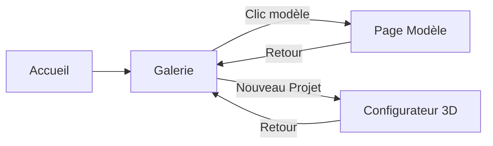

# 🏗️ PLAN DE RECONSTRUCTION COMPLÈTE A → Z

## 🎯 VISION

Recréer **tout le système 3D** from scratch avec une architecture propre, cohérente et extraordinaire.

---

## 🗺️ ARCHITECTURE FINALE

### Structure des Pages

```
/ (Home)
  ↓
/gallery (Galerie des Modèles 3D)
  ├─→ /models/[modelId] (Page dédiée par modèle)
  └─→ /configurator (Configuration 3D complète)
```

### Workflow Utilisateur



---

## 📦 PAGES À CRÉER (NOUVELLES)

### 1. `/gallery` - Galerie Principale
**Fichier :** `pages/gallery.tsx`

**Contenu :**
- Header avec titre "Galerie de Modèles 3D"
- Bouton "🚀 Nouveau Projet" (mène vers `/configurator`)
- Grille de modèles avec preview 3D
- Filtres par catégorie
- Recherche
- Badge "⭐ Ultra" pour modèles ultra-réalistes
- **Clic sur carte → Navigation vers `/models/[modelId]`**

### 2. `/models/[modelId]` - Page Dédiée par Modèle
**Fichier :** `pages/models/[modelId].tsx`

**Contenu :**
- Viewer 3D plein écran (70% de la page)
- Sidebar avec informations :
  - Nom du modèle
  - Description complète
  - Spécifications techniques
  - Dimensions
  - Puissance
  - Tags
  - Badge qualité
- Contrôles du viewer :
  - Rotation automatique (toggle)
  - Grille (toggle)
  - Zoom vers curseur
- Bouton "← Retour à la galerie"
- Bouton "🚀 Utiliser dans un projet" (mène vers `/configurator` avec modèle pré-sélectionné)

### 3. `/configurator` - Configurateur 3D Complet
**Fichier :** `pages/configurator.tsx`

**Contenu :**
- Scène 3D plein écran
- Toolbar avec :
  - "📦 Modèles" - Sélecteur de modèles
  - "↔️ Déplacer" - Mode translation
  - "🔄 Rotation" - Mode rotation
  - "🗑️ Supprimer" - Supprimer objet
  - "💾 Sauvegarder" - Sauvegarder le projet
- Info panel :
  - Nombre d'objets
  - Objet sélectionné
  - Modèle en cours de placement
- Système de placement complet
- Manipulation d'objets
- Zoom vers curseur

---

## 🔄 PAGES À MODIFIER

### 1. `pages/index.tsx` - Page d'Accueil
**Changements :**
- Modifier le lien du "3D Configurator"
- Pointer vers `/gallery` au lieu de `/3d-configurator`
- Ou ajouter 2 cartes :
  - "📦 Galerie de Modèles" → `/gallery`
  - "🎮 Configurateur 3D" → `/configurator`

### 2. `pages/3d-configurator.tsx` - À Renommer/Supprimer
**Options :**
- **Option A :** Supprimer complètement et recréer
- **Option B :** Renommer en `gallery.tsx` et simplifier
- **Option C :** Garder et créer `gallery.tsx` séparément

---

## 🗑️ PAGES À SUPPRIMER (ANCIENNES)

- ❌ `pages/test-models.tsx` - Remplacé par pages dédiées `/models/[modelId]`
- ❌ `pages/containers-3d-editor.tsx` - Ancien système
- ❌ `pages/cooling-module.tsx` - Ancien système
- ❌ `pages/shaping.tsx` - Ancien système
- ❌ `pages/substation-3d-spline.tsx.disabled` - Désactivé

---

## 🎨 COMPOSANTS À CRÉER

### 1. `ModelViewer3D.tsx`
Viewer 3D réutilisable pour les pages dédiées :
- Props : `model: UnifiedModel`
- Contrôles complets
- Rotation automatique
- Grille optionnelle
- Zoom vers curseur

### 2. `ModelInfoSidebar.tsx`
Sidebar d'informations pour les pages dédiées :
- Affiche toutes les métadonnées
- Design moderne
- Boutons d'action

### 3. `GalleryGrid.tsx`
Grille de modèles réutilisable :
- Preview 3D par carte
- Filtres
- Recherche
- Navigation vers pages dédiées

---

## 📊 ARCHITECTURE DES DONNÉES

### UnifiedModelCatalog (Existant - À Garder)
```typescript
UNIFIED_MODEL_CATALOG
  ├─→ 10 Modèles
  ├─→ Fonctions utilitaires
  └─→ Types TypeScript
```

### Routing Next.js
```
/gallery
  └─→ Affiche tous les modèles

/models/[modelId]
  └─→ Page dédiée pour chaque modèle
  └─→ Utilise getModelById(modelId)

/configurator
  └─→ Scène 3D de configuration
  └─→ Placement et manipulation
```

---

## 🎯 WORKFLOW FINAL

### Parcours 1 : Explorer les Modèles
```
1. Home → Clic "Galerie de Modèles"
2. Gallery → Voir tous les modèles
3. Clic sur un modèle → Page dédiée plein écran
4. Voir le modèle en 3D + toutes les infos
5. Bouton "Retour" → Retour à la galerie
```

### Parcours 2 : Créer un Projet
```
1. Home → Clic "Configurateur 3D"
   OU
   Gallery → Clic "🚀 Nouveau Projet"
2. Configurator → Scène 3D vide
3. Clic "📦 Modèles" → Sélectionner un modèle
4. Clic sur le sol → Placer le modèle
5. Manipuler (déplacer, rotation, supprimer)
6. Ajouter d'autres modèles
7. Sauvegarder le projet
```

### Parcours 3 : Utiliser un Modèle dans un Projet
```
1. Gallery → Clic sur un modèle
2. Page dédiée → Voir le modèle
3. Clic "🚀 Utiliser dans un projet"
4. Configurator → Scène 3D avec modèle pré-sélectionné
5. Placer et configurer
```

---

## 🔧 ÉTAPES DE RECONSTRUCTION

### Phase 1 : Créer la Nouvelle Galerie
1. Créer `pages/gallery.tsx` (nouvelle page propre)
2. Créer `components/gallery/GalleryGrid.tsx`
3. Créer `components/gallery/GalleryHeader.tsx`
4. Créer `components/gallery/ModelCard.tsx`

### Phase 2 : Créer les Pages Dédiées
1. Créer le dossier `pages/models/`
2. Créer `pages/models/[modelId].tsx`
3. Créer `components/models/ModelViewer3D.tsx`
4. Créer `components/models/ModelInfoSidebar.tsx`

### Phase 3 : Créer le Configurateur
1. Créer `pages/configurator.tsx` (nouvelle page propre)
2. Réutiliser `EquipmentPlacer.tsx` (déjà bon)
3. Réutiliser `ModelSelectorPanel.tsx` (déjà bon)
4. Créer `components/configurator/ConfiguratorToolbar.tsx`
5. Créer `components/configurator/ConfiguratorInfoPanel.tsx`

### Phase 4 : Mettre à Jour la Navigation
1. Modifier `pages/index.tsx` - Ajouter liens vers `/gallery` et `/configurator`
2. Supprimer l'ancien `pages/3d-configurator.tsx`
3. Supprimer les anciennes pages obsolètes

### Phase 5 : Nettoyer et Tester
1. Supprimer tous les anciens fichiers
2. Tester chaque page
3. Vérifier la navigation
4. Documenter le nouveau système

---

## 📁 STRUCTURE FINALE

```
pages/
  ├─ index.tsx (Home)
  ├─ gallery.tsx (Galerie - NOUVEAU)
  ├─ configurator.tsx (Configurateur - NOUVEAU)
  ├─ models/
  │  └─ [modelId].tsx (Pages dédiées - NOUVEAU)
  ├─ mining-dashboard.tsx (Garder)
  └─ infrastructure.tsx (Garder)

components/
  ├─ gallery/ (NOUVEAU)
  │  ├─ GalleryGrid.tsx
  │  ├─ GalleryHeader.tsx
  │  └─ ModelCard.tsx
  ├─ models/ (NOUVEAU)
  │  ├─ ModelViewer3D.tsx
  │  └─ ModelInfoSidebar.tsx
  ├─ configurator/ (NOUVEAU)
  │  ├─ ConfiguratorToolbar.tsx
  │  └─ ConfiguratorInfoPanel.tsx
  └─ 3d/ (Existant - Modèles 3D)
     ├─ UnifiedModelCatalog.tsx ⭐
     ├─ ModelSelectorPanel.tsx
     ├─ EquipmentPlacer.tsx
     └─ [Tous les modèles 3D]
```

---

## 🎨 DESIGN SYSTEM

### Couleurs
- **Primary :** `#8AFD81` (Vert Hearst)
- **Background :** `#0a0b0d` (Noir profond)
- **Secondary BG :** `#0b1120` (Bleu très foncé)
- **Text :** `#0b1120` (Texte principal)

### Composants UI
- Boutons avec hover effects
- Cards avec shadow et border
- Badges pour qualité
- Toolbar moderne
- Sidebar élégante

---

## ✅ CE QUI SERA GARDÉ

### Système Unifié (Parfait)
- ✅ `UnifiedModelCatalog.tsx` - Source de vérité
- ✅ `ModelSelectorPanel.tsx` - Sélecteur de modèles
- ✅ `EquipmentPlacer.tsx` - Système de placement
- ✅ Tous les modèles 3D ultra-réalistes

### Composants 3D (Parfaits)
- ✅ 7 modèles ultra-réalistes
- ✅ 3 modèles standards
- ✅ SceneLighting
- ✅ EnvironmentHDRI
- ✅ SandyGround

---

## 🗑️ CE QUI SERA SUPPRIMÉ

### Pages Obsolètes
- ❌ `pages/3d-configurator.tsx` (ancien système)
- ❌ `pages/test-models.tsx` (remplacé par pages dédiées)
- ❌ `pages/containers-3d-editor.tsx`
- ❌ `pages/cooling-module.tsx`
- ❌ `pages/shaping.tsx`

### Composants Obsolètes
- Tous déjà supprimés ! ✅

---

## 🚀 RÉSULTAT FINAL

### Navigation Simple et Claire
```
Home
  ├─→ Galerie (voir tous les modèles)
  │   ├─→ Page Modèle 1 (détails complets)
  │   ├─→ Page Modèle 2 (détails complets)
  │   └─→ ...
  └─→ Configurateur (créer un projet)
```

### Expérience Utilisateur
1. **Explorer** - Galerie avec tous les modèles
2. **Découvrir** - Page dédiée par modèle
3. **Créer** - Configurateur pour projets
4. **Manipuler** - Placement et configuration

---

## 📊 ESTIMATION

### Fichiers à Créer
- 3 pages nouvelles (gallery, configurator, models/[modelId])
- 6 composants nouveaux (GalleryGrid, ModelCard, etc.)
- 1 fichier de documentation

**Total :** ~10 nouveaux fichiers

### Fichiers à Supprimer
- 5 pages anciennes
- Composants déjà nettoyés

**Total :** ~5 fichiers

### Temps Estimé
- Phase 1 (Galerie) : 15 min
- Phase 2 (Pages dédiées) : 20 min
- Phase 3 (Configurateur) : 15 min
- Phase 4 (Navigation) : 10 min
- Phase 5 (Tests) : 10 min

**Total :** ~70 minutes

---

## 🎉 AVANTAGES

### Architecture
- ✅ Séparation claire des responsabilités
- ✅ Pages dédiées pour chaque fonction
- ✅ Code propre et organisé
- ✅ Facile à maintenir

### Expérience
- ✅ Navigation intuitive
- ✅ Pages dédiées immersives
- ✅ Workflow clair
- ✅ Performance optimale

### Code
- ✅ Composants réutilisables
- ✅ Pas de code dupliqué
- ✅ TypeScript strict
- ✅ Documentation complète

---

## ❓ QUESTIONS AVANT DE COMMENCER

### 1. Page d'Accueil
Voulez-vous modifier `pages/index.tsx` pour avoir :
- **Option A :** 2 cartes séparées ("Galerie" + "Configurateur")
- **Option B :** 1 carte "3D Configurator" qui mène vers la galerie
- **Option C :** Garder tel quel

### 2. Nom des Routes
- `/gallery` et `/configurator` ?
- Ou `/3d-gallery` et `/3d-configurator` ?
- Ou autre chose ?

### 3. Page Dédiée - Contenu
Voulez-vous :
- **Simple :** Viewer 3D + infos basiques
- **Détaillé :** Viewer 3D + toutes les spécifications + documentation
- **Personnalisé :** Dites-moi ce que vous voulez voir

### 4. Ancien Configurateur
Que faire de `pages/3d-configurator.tsx` actuel ?
- **Supprimer** complètement et recréer
- **Renommer** en `gallery.tsx` et adapter
- **Garder** et créer à côté

---

**Répondez à ces questions et je commence la reconstruction immédiatement ! 🚀**


